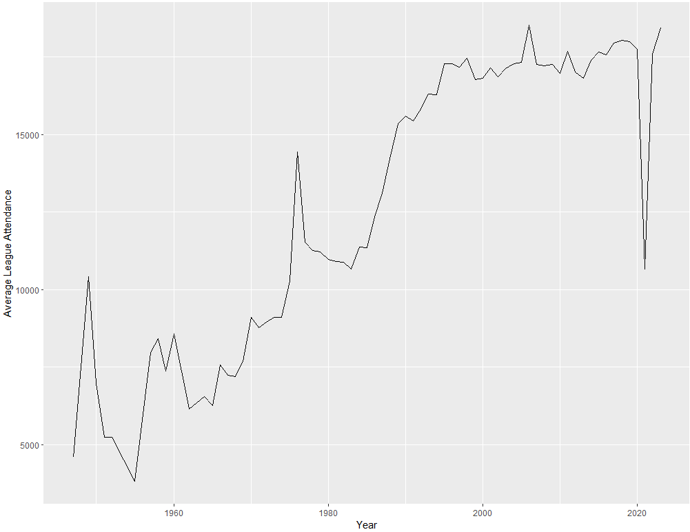
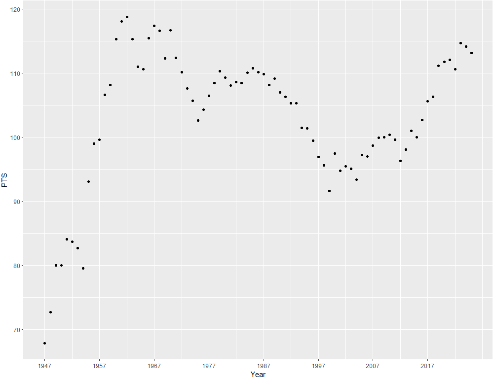
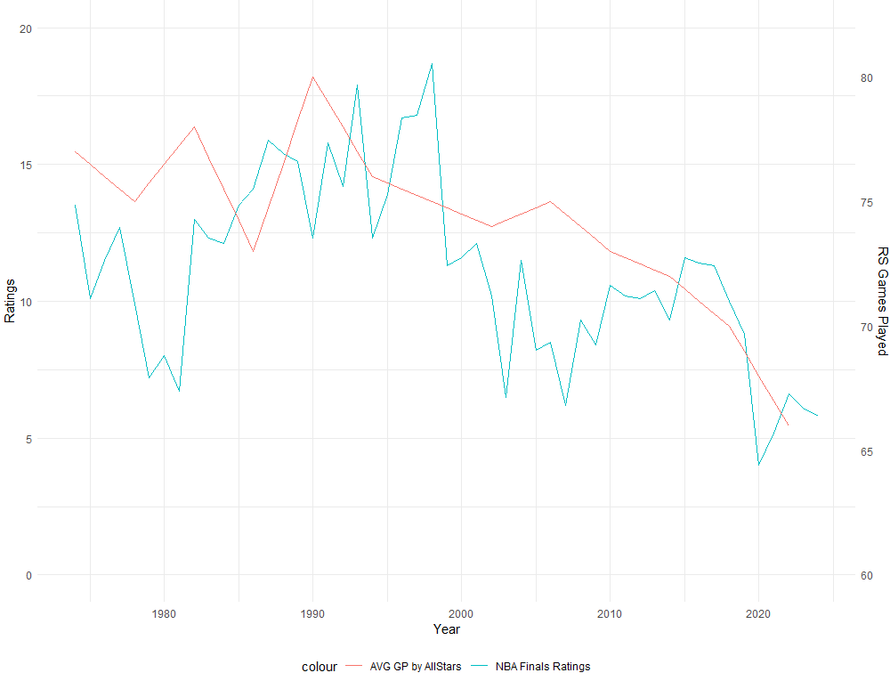

# What NBA Players have had the most Overall Influence on Viewership
### R Coding:
```
install.packages(c("tidyverse", "rvest", "zoo"))
library(tidyverse)
library(rvest)
library(zoo)
```
`game_info` gives each NBA game a unique ID, it's date, attendance, and how long the game lasts. Many games do not have `game_time` recorded, and some don't have `attendance` recorded. So, I'll only take games that have `attendance` recorded, and merge that with another dataframe called `game`. This has the same ID number for every NBA game in history, but gives box score stats like the home team name, away team name, and basic stats like points, rebounds, assists, etc.
```
attendance = game_info %>% filter (!is.na(attendance))
games = merge(game, attendance, by = "game_id")
gamesNew = games[!duplicated(games), ]
```
This code before was so I can see who is playing in these games. Many of these recorded games were between NBA teams and China, and some were games in an old different basketball league called the ABA, or between two past teams that are now defunct. So, I will take only modern NBA teams and their former names to narrow down this data to only the NBA games I want. I will graph `average_attendance` by year across the entire league.
```
nba_teams = c("Atlanta Hawks", "St. Louis Hawks", "Milwaukee Hawks", "Tri-Cities Blackhawks", "Boston Celtics", "Brooklyn Nets", "New Jersey Nets", "New York Nets", "Charlotte Hornets", "Charlotte Bobcats", "Chicago Bulls", "Cleveland Cavaliers", "Dallas Mavericks", "Denver Nuggets", "Detroit Pistons", "Fort Wayne Pistons", "Golden State Warriors", "San Francisco Warriors", "Philadelphia Warriors", "Houston Rockets", "San Diego Rockets", "Indiana Pacers", "Los Angeles Clippers", "Buffalo Braves", "Los Angeles Lakers", "Minneapolis Lakers", "Memphis Grizzlies", "Vancouver Grizzlies", "Miami Heat", "Milwaukee Bucks", "Minnesota Timberwolves", "New Orleans Pelicans", "New Orleans Hornets", "NO/Ok. City Hornets", "New York Knicks", "Oklahoma City Thunder", "Seattle SuperSonics", "Orlando Magic", "Philadelphia 76ers", "Syracuse Nationals", "Phoenix Suns", "Portland Trail Blazers", "Sacramento Kings", "Kansas City Kings", "Kansas City-Omaha Kings", "Cincinnati Royals", "Rochester Royals", "San Antonio Spurs", "Texas Chaparrals", "Dallas Chaparrals", "Toronto Raptors", "Utah Jazz", "New Orleans Jazz", "Washington Wizards", "Washington Bullets", "Capital Bullets", "Baltimore Bullets", "Chicago Zephyrs", "Chicago Packers")

fgames = games %>%
  filter(team_name_home %in% nba_teams & team_name_away %in% nba_teams)

fgames$game.date.x = as.Date(fgames$game_date.x)

average_attendance = fgames %>% mutate(year = format(game_date.x, "%Y")) %>% group_by(year) %>% summarize(avg_attendance = mean(attendance, na.rm = TRUE))

ggplot(average_attendance, aes(x = as.numeric(year), y = avg_attendance)) + geom_line() + xlab("Year") + ylab("Average League Attendance")
```

While this may look like the NBA had blown up around 1985 and stayed stagnant since, it is more just becuase stadiums are being sold out, and the size of NBA arenas has increased relatively little since the 1960s. But, this does show that the league was increasing in popularity from 1960-1980, then blowing up in the mid 80s, which was right at the time Michael Jordan was drafted into the league.

I then imported a table from Wikipedia, that shows every NBA finals game and it's rating. This was the best thing I could find that provided me with historical TV viewership data, and surprisingly it is rather difficult to find this type of information on the NBA. Rating is the percentage of US households that watched the game.
```
df = read_html("https://en.wikipedia.org/wiki/NBA_Finals_television_ratings")
tables = df %>% html_table(fill = TRUE)
table = tables[[4]]

table[] = lapply(table, function(x) sub("^([0-9.]+).*", "\\1", x))
nbaRatings = table
nbaRatings$Year = as.numeric(nbaRatings$Year)
nbaRatings$Avg = as.numeric(nbaRatings$Avg)
```
Now that I have cleaned up the data, I'll graph it.
```
ggplot(nbaRatings, aes(x = Year, y = Avg)) + geom_point() + scale_x_continuous(breaks = seq(min(nbaRatings$Year), max(nbaRatings$Year), by = 10)) + ylab("Average TV Ratings of NBA Finals")
```

You can see the TV viewership has actually gone down quite a bit in recent history, which goes against what attendance showed us. There was a large dropoff right after Michael Jordan's final NBA Finals appearance and championship in 1998, then another one around 2019.

Next, I'll see if  points has some relation to this dropoff. `yearlyStats` is a dataframe that has the averages of things like height, weight, and basic stats like points of all nba games every year. I'll use it to see if points is correlated to the decline in Ratings.
```
ratingsStats = merge(yearlyStats, nbaRatings, by = "Year", all = TRUE)
ratingsStats = ratingsStats %>% arrange(desc(Year))
colnames(yearlyStats) <- yearlyStats[1, ]
yearlyStats <- yearlyStats[-1, ]
colnames(yearlyStats)[colnames(yearlyStats) == "Season?"] <- "Year"
yearlyStats$Year <- substr(yearlyStats$Year, nchar(yearlyStats$Year) - 1, nchar(yearlyStats$Year))
yearlyStats$Year <- paste0("19", yearlyStats$Year)
yearlyStats$Year[1:26] <- substr(yearlyStats$Year[1:26], nchar(yearlyStats$Year[1:26]) - 1, nchar(yearlyStats$Year[1:26]))
yearlyStats$Year[1:26] <- paste0("20", yearlyStats$Year[1:26])
yearlyStats$Year <- as.numeric(yearlyStats$Year)
yearlyStats$PTS <- as.numeric(yearlyStats$PTS)
nbaRatings$Year = as.numeric(nbaRatings$Year)

ggplot(yearlyStats, aes(x=Year, y=PTS))+geom_point()+scale_x_continuous(breaks = seq(min(yearlyStats$Year), max(yearlyStats$Year), by = 10))
```



There is likely way to much code here, and I probably could've done it much more efficiently, but I have this graph and that's all that matters. But, there is no correlation between ratings and points. Average games played by all stars I think will have more correlation. This is been an increasing problem in recent years, and has been said to be influencing this decline.

```
avgAllStars = data.frame(
  Year = c(2022, 2018, 2014, 2010, 2006, 2002, 1998, 1994, 1990, 1986, 1982, 1978, 1974, 1970, 1966, 1962),
  Avg = c(66, 69.75, 72.08, 73.32, 74.6, 74.23, 74.92, 75.77, 79.64, 73.36, 78.32, 74.63, 77.24, 76.12, 77.15, 74.32),
  Total = c(1650, 1953, 1730, 2053, 1865, 1930, 1798, 1970, 1991, 1834, 1958, 1791, 1931, 1903, 1543, 1858)
  )
avgAllStars$Players = (avgAllStars$Total/avgAllStars$Avg)
avgAllStars = round(avgAllStars)

allStats = merge(ratingsStats, avgAllStars, by = "Year", all = TRUE)
allStats = allStats %>% arrange(desc(Year))
allStats$Avg.y = na.approx(allStats$Avg.y, na.rm = FALSE)


allStats$Avg.x = as.numeric(allStats$Avg.x)
allStats$Avg.y = as.numeric(allStats$Avg.y)
```
Now, `allStats` is a dataframe that has finals ratings, average regular season games played by all stars, average stats by NBA teams. Time for the graph:
```
ggplot(allStats, aes(x = Year)) +
  geom_line(aes(y = Avg.x, color = "NBA Finals Ratings")) + geom_line(aes(y = (Avg.y - 60) / (82 - 60) * 20, color = "AVG GP by AllStars")) + 
  scale_y_continuous(limits = c(0, 20), sec.axis = sec_axis(~ . * (82 - 60) / 20 + 60, name = "RS Games Played")) +
  scale_x_continuous(limits = c(1974, 2024)) +
  ylab("Ratings") + theme_minimal() + theme(legend.position = "bottom")
```

This shows this is likely a big reason for TV ratings. So, while this has been harder than I had thought beforehand, I think I have found a large reason for the decline in TV viewership in recent years. But a larger reason is likely due to COVID hurting overall TV viewership of sports, and things like ESPN+ hurting viewership statistics.
