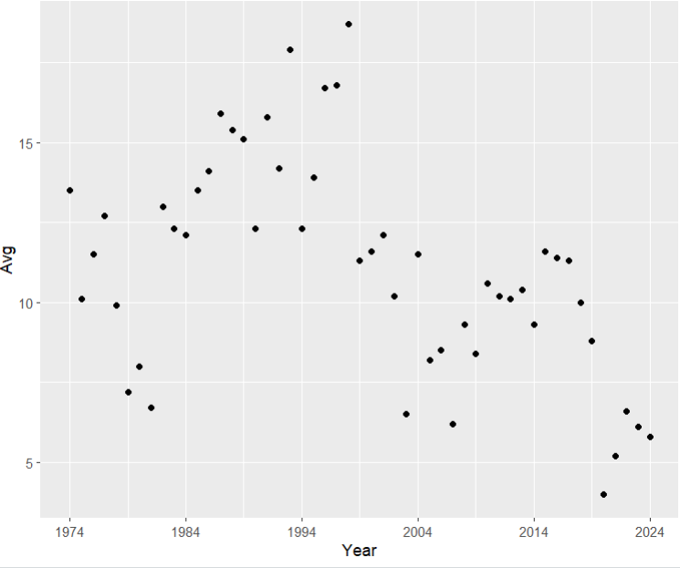

# Thinking Machines Final Project
### R Coding:
```
install.packages("tidyverse")
library(tidyverse)
install.packages("rvest")
library(rvest)

df = read_html("https://en.wikipedia.org/wiki/NBA_Finals_television_ratings")
tables = df %>% html_table(fill = TRUE)
table = tables[[4]]
View(table)
table[] <- lapply(table, function(x) sub("^([0-9.]+).*", "\\1", x))
nbaRatings = table

nbaRatings$Year = as.numeric(nbaRatings$Year)
nbaRatings$Avg = as.numeric(nbaRatings$Avg)

ggplot(nbaRatings, aes(x = Year, y = Avg)) + geom_point() + scale_x_continuous(breaks = seq(min(nbaRatings$Year), max(nbaRatings$Year), by = 10))
```

